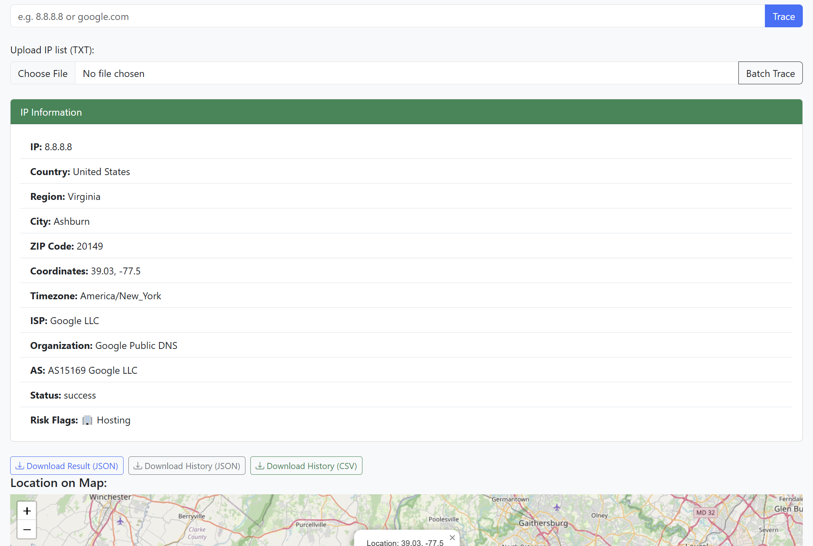

# 🌍 IP Tracer - Fuad Edition

A modern, full-featured IP and domain geolocation tracer built with **Java 21**, **Spring Boot 3**, and **Thymeleaf**.  
Get location, ISP, timezone and coordinates of any IP or domain — displayed beautifully with map visualization and search history.

---

## 🚀 Features

✅ Trace IP addresses or domain names  
✅ Show full geolocation data (country, city, region, ISP, ZIP, coordinates, timezone, etc.)  
✅ Display result on map using **Leaflet.js**  
✅ Session-based search history (auto-reversed: latest on top)  
✅ Batch IP Trace via .txt file upload  
✅ Export single result, history, or batch results as **JSON** or **CSV**  
✅ Interactive "More" modal with detail view and export options  
✅ Responsive and clean UI with **Bootstrap 5**  
✅ Sticky footer & favicon support  
✅ Full error handling with friendly messages  
✅ Ready for future enhancements: DB support, login, analytics, and more

---

## 🖥️ Tech Stack

- Java 21
- Spring Boot 3
- Thymeleaf (template engine)
- Bootstrap 5 (UI)
- Leaflet.js (map marker)
- Gson (JSON parser)
- Maven/Gradle (build tool)

---

## 📷 Screenshot

> 💡 **

---

## 🔧 Run Locally

### 1. Clone the repo:
```bash
git clone https://github.com/FuadValiyev/ip-tracer.git
cd ip-tracer
